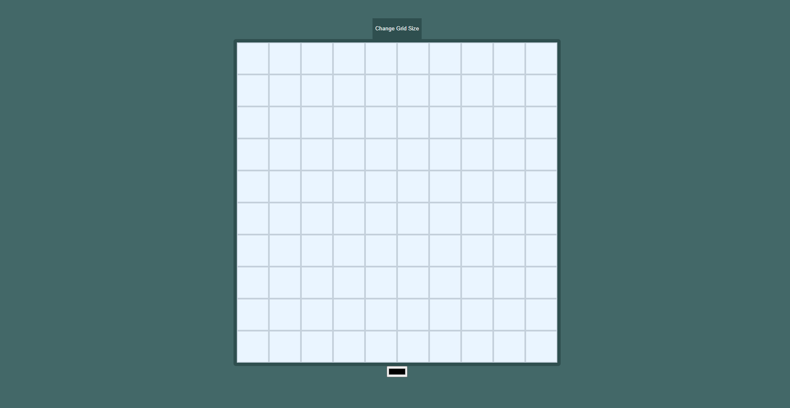

# Etch-a-Sketch

A browser-based “Etch-a-Sketch / sketch pad” web app built with **HTML**, **CSS**, and **JavaScript**.  
Part of The Odin Project Foundations course, this project helps to practice DOM manipulation, event listeners, and dynamic rendering of grid layouts.

---

## Table of Contents

- [Overview](#overview)  
- [Features](#features)  
- [Demo](#demo)  

---

## Overview

This project creates a sketch-pad like interface where users can draw by moving the mouse over a grid of square divs.  
The grid is generated dynamically, with the ability to reset it and change the number of squares per side.  
Hovering (“drawing”) leaves a trail of color as the mouse passes over the squares.  

---

## Features

- Dynamically generated grid (default size, e.g. 16×16)  
- Ability to reset / clear the grid  
- Prompt to choose a new grid size (max limit to avoid performance issues)  
- Hover effect: squares change color when “drawn” over  
- Responsive layout so the sketch area fits well across devices  

---

## Demo

[👉 Live Demo](https://c0debunny.github.io/etch-a-sketch/)

